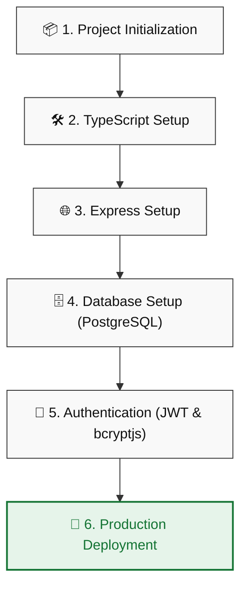

#  Express Architecture Blueprint

> A scalable, production-ready Express.js API blueprint using Modular Pattern, PostgreSQL database persistence, JWT authentication, and Role-Based Authorization.

---

## 🗺️ Workflow Diagram

Below is the workflow visualization representing the setup path:



## 📋 Project Overview & Goals

This project provides a **scalable Express.js API architecture** built with **TypeScript** and integrated with **PostgreSQL** for persistent data storage. It serves as a blueprint for building production‑ready backend applications with clean structure, modular code, and proper error handling.

### 🎯 Core Goals
- **[Express.js API](ca://s?q=Express.js_API_goal)** — Provide a structured RESTful API with CRUD operations.
- **[TypeScript integration](ca://s?q=TypeScript_integration_goal)** — Ensure type safety, maintainability, and developer productivity.
- **[PostgreSQL database](ca://s?q=PostgreSQL_database_goal)** — Use relational schema for secure and efficient data management.
- **[Error handling](ca://s?q=Error_handling_goal)** — Implement proper `try/catch` blocks with meaningful responses (200, 404, 500).
- **[Scalable architecture](ca://s?q=Scalable_architecture_goal)** — Follow clean project structure for future extensions.
- **[Environment configuration](ca://s?q=Environment_configuration_goal)** — Manage secrets and configs via `.env` and `dotenv`.

---

##  Tech Stack & Dependencies

Here is a breakdown of the core technologies and dependencies used in this blueprint:

### ⚡ Core Stack
<p align="left">
  
  
  
  
</p>

### 🔐 Authentication & Middlewares
<p align="left">
  
  
  
  
</p>

### ⚙️ Utilities & Dev Tools
<p align="left">
  
  
</p>

---

##  Express.js & TypeScript Server Setup Steps

Follow this guided setup timeline to initialize, configure, and run the server architecture:

### 📦 1. Project Initialization
Initialize a new Node.js package environment:
```bash
npm init -y
```
In your `package.json`, enable ES Modules and define the development start script:
- Add: `"type": "module"`
- Update `"scripts"`:
  ```json
  "scripts": {
    "dev": "tsx watch ./src/server.ts"
  }
  ```

---

### 🛠️ 2. TypeScript Setup
Install TypeScript as a development dependency (which generates the `package-lock.json` file):
```bash
npm i -D typescript
```

---

### ⚙️ 3. Initialize TypeScript Configuration
Generate the default `tsconfig.json` configuration file:
```bash
npx tsc --init
```
Update the generated `tsconfig.json` properties:
- **Comment out**:
  - `"rootDir": "./src"`
  - `"outDir": "./dist"`
- **Remove**:
  - `"jsx": "react-jsx"`
- **Edit**:
  - `"module": "esnext"`
  - `"types": ["node"]`

---

### 🌐 4. Express.js Installation
Install the Express web application framework:
```bash
npm install express
```

---

### 🏷️ 5. Express.js TypeScript Definitions
Install type declarations for Express to support static typing:
```bash
npm i --save-dev @types/express
```

---

### 📂 6. Project Structure Creation
1. Create a `src` directory in the root workspace.
2. Create a `server.ts` file inside the `src` folder.

Add the following initial server setup code in `src/server.ts`:
```typescript
import express, { type Application, type Request, type Response } from "express";

const app: Application = express();
const port = process.env.PORT || 3000;

// Parse JSON payloads from incoming requests
app.use(express.json());

app.get("/", (req: Request, res: Response) => {
    res.status(200).json({
        status: "success",
        message: "Express Architecture Blueprint API is live and ready to handle requests",
        version: "1.0.0",
        author: "Islamul Hoque"
    });
});

app.listen(port, () => {
    console.log(`Server is running at http://localhost:${port}`);
});
```

---

### 🖥️ 7. Development Tools Compilation
Compile your TypeScript code and run the development server:
- Run compile check:
  ```bash
  npx tsc
  ```
- Run the server in development mode:
  ```bash
  npm run dev
  ```
- The server will run at: `http://localhost:3000` (or your custom `PORT` from environment variables).

---

### 🔌 8. PostgreSQL Client Setup
Install the PostgreSQL client library:
```bash
npm install pg
```

---

### 🏷️ 9. PostgreSQL Type Definitions
Install type definitions for PostgreSQL client:
```bash
npm i --save-dev @types/pg
```

---

### 🔑 10. Environment Variables Configuration
Install the dotenv module and create the local environment file:
- Install module:
  ```bash
  npm i dotenv
  ```
- Create a `.env` file in the root layout to store secrets and database connection configurations.

---

### 🗄️ 11. Database Setup (Neon PostgreSQL)
This project uses **Neon cloud-hosted PostgreSQL** as the database. The database connection is managed via `pg` connection pool and environment variables stored in `.env`.

Initialize the pool using your configurations:
```typescript
// Initialize Pool with Neon cloud-hosted PostgreSQL connection
const pool = new Pool({
    connectionString: config.connection_string,
});
```

---

### 🔒 12. Bcrypt.js Hashing
Install `bcryptjs` for secure password hashing:
```bash
npm i bcryptjs
```

---

### 🎟️ 13. JWT for Authentication
Install `jsonwebtoken` for generating and verifying tokens:
```bash
npm i jsonwebtoken
```

---

### 🏷️ 14. JWT Type Definitions
Install type declarations for `jsonwebtoken`:
```bash
npm i --save-dev @types/jsonwebtoken
```

---

### 🎲 15. Generate JWT Secret Key
Generate a secure random secret key to sign your JWTs:
```bash
node -e "console.log(require('crypto').randomBytes(64).toString('hex'))"
```

---

### 🍪 16. Cookie Parser Setup
Install `cookie-parser` middleware to read cookies from request headers:
```bash
npm i cookie-parser
```

---

### 🏷️ 17. Cookie Parser Type Definitions
Install type definitions for `cookie-parser`:
```bash
npm i --save-dev @types/cookie-parser
```

---

### 🌐 18. CORS Middleware Setup
Install CORS (Cross-Origin Resource Sharing) middleware to handle cross-origin requests:
```bash
npm i cors
```

---

### 🏷️ 19. CORS Type Definitions
Install type definitions for `cors`:
```bash
npm i --save-dev @types/cors
```

---

## 🚀 Production Build & Deployment

Follow the steps below to build the project and deploy it to Vercel.

### 📦 1. Building the Application (tsup)

`tsup` is used to bundle our TypeScript application into clean JavaScript output in the `dist` directory.

#### Step 1.1: Install `tsup`
```bash
npm i tsup
```

#### Step 1.2: Create configuration
Create a file named `tsup.config.ts` in the root layout directory and add the following configuration:
```typescript
import { defineConfig } from "tsup";

export default defineConfig({
    entry: ["src/server.ts"],
    format: ["esm", "cjs"], // Keep this as ESM
    target: "esnext",
    outDir: "dist",
    clean: true,
    bundle: true,
    splitting: false,
    sourcemap: true,
    // Add this banner to shim require() for CJS dependencies
    banner: {
        js: `
            import { createRequire } from 'module';
            const require = createRequire(import.meta.url);
        `,
    },
});
```

#### Step 1.3: Update Scripts & Configuration Files

In **`package.json`**, add/update the start, dev, and build scripts:
```json
"scripts": {
  "start": "node dist/server.js",
  "dev": "tsx watch ./src/server.ts",
  "build": "tsup"
}
```

In **`tsconfig.json`**, include and exclude compiler directories at the bottom of the config:
```json
{
  "include": ["src/**/*"],
  "exclude": []
}
```

#### Step 1.4: Build & Test Locally
Run the following commands to build and run the compiled code:
```bash
npm run build
npm start
```

---

### ☁️ 2. Deploying to Vercel

Deploy the compiled distribution output directly onto Vercel hosting.

#### Step 2.1: Install Vercel CLI & Log In
```bash
npm i -g vercel 
vercel login
```

#### Step 2.2: Configure Vercel Routes
Create a file named `vercel.json` in the root directory:
```json
{
    "version": 2,
    "builds": [
        {
            "src": "dist/server.js",
            "use": "@vercel/node"
        }
    ],
    "routes": [
        {
            "src": "/(.*)",
            "dest": "dist/server.js"
        }
    ]
}
```

#### Step 2.3: Trigger Production Deployment
Deploy your application build to Vercel:
```bash
vercel --prod
```

---

##  Author

### 👤 Islamul Hoque
*MERN Stack Developer | Backend Enthusiast | Problem Solver*

Get in touch or check out my profiles:

<p align="left">
  <a href="https://www.linkedin.com/in/Islamul-Hoque" target="_blank">
    
  </a>
  <a href="mailto:islamulhoque2006@gmail.com">
    
  </a>
  <a href="https://islamul-hoque-portfolio.vercel.app" target="_blank">
    
  </a>
  <a href="https://codeforces.com/profile/Islamul-Hoque" target="_blank">
    
  </a>
  <a href="https://www.hackerrank.com/profile/Islamul_Hoque" target="_blank">
    
  </a>
</p>
